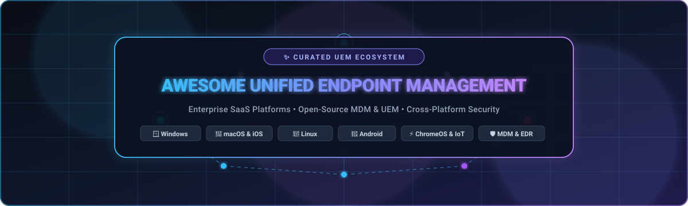

  

# 🚀 Awesome Unified Endpoint Management (UEM) & MDM Ecosystem

  
  
  
  
  
  
  

---

## 🌟 Overview & Market Landscape

> **A curated, battle-tested list of leading SaaS Platforms & Open-Source Projects for Unified Endpoint Management (UEM), Mobile Device Management (MDM), IT Asset Management (ITAM), Remote Monitoring & Management (RMM), and Cross-Platform Fleet Security.**

Unified Endpoint Management (UEM) empowers IT administrators, SecOps teams, MSPs, and enterprises to discover, provision, secure, patch, and manage desktops, laptops, mobile devices, servers, and IoT endpoints across **Windows**, **macOS**, **Linux**, **iOS**, **Android**, and **ChromeOS** from a single pane of glass.

Whether you are seeking an enterprise-grade cloud solution with zero-trust compliance or a self-hosted, telemetry-rich open-source framework, this guide provides complete transparency into starting prices, free tier allowances, company valuations, and repository popularity.

---

## 📑 Table of Contents

- [🏢 SaaS & Hosted Enterprise Platforms](#-saas--hosted-enterprise-platforms)
- [💻 Open-Source GitHub Projects](#-open-source-github-projects)
- [🛠️ Architecture & Integration Guide](#️-architecture--integration-guide)
- [🤝 How to Contribute](#-how-to-contribute)
- [📊 Star History](#-star-history)
- [⚖️ Disclaimer](#️-disclaimer)

---

## 🏢 SaaS & Hosted Enterprise Platforms

The table below is ranked in **descending order by company size** (market capitalization / enterprise valuation and annual revenue) to help organizations assess vendor stability, enterprise scale, and licensing structures.

| 🏷️ Product | 📊 Company Size / Valuation | 📝 Description | 💵 Starting Pricing | 🎁 Free Tier / Free Trial Limits |
| :--- | :--- | :--- | :--- | :--- |
| **[Microsoft Intune](https://www.microsoft.com/en-us/security/business/microsoft-intune)** | **~$3.1 Trillion** Market Cap *(~$245B+ Annual Revenue)* | 🛡️ Cloud-native UEM platform deeply integrated with Microsoft 365, Entra ID, and Defender for managing Windows, macOS, iOS, Android, and Linux. | Starts at **$8.00/user/month** *(Intune Plan 1, billed annually)* | ⏱️ No permanent free tier; **30-day free trial** with up to **25 user licenses** |
| **[IBM MaaS360](https://www.ibm.com/products/maas360)** | **~$210 Billion** Market Cap *(~$62B+ Annual Revenue)* | 🤖 AI-enhanced cognitive UEM solution supporting diverse endpoints with robust zero-trust security, containerization, and compliance automation. | Starts at **$4.00/device/month** *(Essentials Edition; Fast Start promos from $1.50/device/mo)* | ⏱️ No permanent free tier; **30-day free trial** with full feature access and unlimited test enrollments |
| **[ManageEngine Endpoint Central](https://www.manageengine.com/products/desktop-central/)** | **~$10B+** Valuation *(Zoho Corp)* *(~$1.4B+ Annual Revenue)* | 🖥️ Full-spectrum UEM & RMM suite covering automated patch management, software deployment, remote control, and OS imaging. | Starts at **~$795/year for 50 endpoints** *(~$1.33/endpoint/month)* | ♾️ **Free forever plan** for up to **25 computers & 25 mobile devices**; **30-day fully functional trial** |
| **[Ivanti Neurons](https://www.ivanti.com/)** | **~$4.0B+** Enterprise Valuation *(~$1.4B+ Annual Revenue)* | ⚡ Hyper-automated, AI-powered UEM and patch remediation platform built for complex, heterogeneous enterprise environments. | Starts at **~$7.50/device/month** *(~$90/device/yr or ~$25–$59/user/yr)* | ⏱️ No permanent free tier; **30-day evaluation / Proof-of-Concept (POC)** environment via sales |
| **[VMware Workspace ONE (Omnissa)](https://www.omnissa.com/)** | **~$4.0 Billion** Valuation *(KKR)* *(~$1.0B+ Annual Revenue)* | 🌐 Comprehensive digital workspace platform delivering UEM, conditional access, identity federation, and virtual app delivery. | Starts at **~$3.78 – $5.00/device/month** *(Mobile / UEM Essentials tier)* | ⏱️ No permanent free tier; **30-day free trial** *(up to 100 devices upon sales evaluation)* |
| **[Jamf](https://www.jamf.com/)** | **~$2.2 Billion** Market Cap *(NASDAQ: JAMF)* *(~$600M+ Annual Revenue)* | 🍏 Gold-standard Apple device management platform (Jamf Pro, Jamf Now, Jamf School) with day-zero Apple OS integration and declarative MDM. | **Jamf Now**: **$4.00/device/month** **Jamf Pro**: **$5.75/mobile & $12.50/Mac/month** *(25-device min)* | ♾️ **Free forever plan** on Jamf Now for up to **3 devices**; **14-day to 30-day free trial** on Jamf Pro |
| **[SOTI](https://www.soti.net/)** | **~$1.0B+** Valuation *(Private)* *(~$175M+ Annual Revenue)* | 📱 Specialized mobility and IoT UEM platform with deep capabilities for ruggedized barcode scanners, field hardware, Linux, and Android. | Starts at **~$4.00/device/month** *(Cloud entry tier)* | ⏱️ No permanent free tier; **30-day free trial** with full enterprise capabilities |
| **[Kandji](https://www.kandji.io/)** | **~$800 Million** Valuation *(Series C)* *(~$60M+ Annual ARR)* | 🪄 Next-generation Apple MDM/UEM emphasizing automated compliance blueprints, 150+ pre-built controls, and frictionless zero-touch deployment. | Starts at **~$3.20 – $4.00/device/month** *(Core Apple MDM starting tier)* | ⏱️ No permanent free tier; **14-day free trial** for core MDM/UEM features *(no credit card required)* |
| **[Hexnode](https://www.hexnode.com/)** | **~$500M+** Valuation *(Mitsogo)* *(~$50M+ Annual ARR)* | 🔒 Intuitive multi-OS UEM and kiosk management suite featuring robust lockdown modes, geofencing, digital signage, and application controls. | Starts at **$2.00/device/month** *(Pro plan, billed annually; 15-device minimum)* | ⏱️ No permanent free tier; **14-day free trial** with full Ultra tier access & **unlimited devices** *(no CC needed)* |
| **[Scalefusion](https://scalefusion.com/)** | **~$200M+** Valuation *(ProMobi)* *(~$30M+ Annual ARR)* | 🎯 Modern endpoint management suite offering multi-platform kiosk lockdown, content distribution, zero-touch enrollment, and live screen cast. | Starts at **$2.00/device/month** *(Essentials plan, billed annually; 10-device minimum)* | ⏱️ No permanent free tier; **14-day free trial** with full Enterprise features & **unlimited devices** *(no CC needed)* |

---

## 💻 Open-Source GitHub Projects

The projects below are ranked in **descending order by GitHub stargazers count**, highlighting community popularity, maturity, and active development.

- **[RustDesk](https://github.com/rustdesk/rustdesk)**   
  🖥️ **High-Performance Self-Hosted Remote Assistance & Endpoint Control** — Full open-source alternative to TeamViewer and AnyDesk, written in Rust with end-to-end encryption and self-hosted relay servers.

- **[osquery](https://github.com/osquery/osquery)**   
  🔍 **SQL-Powered Endpoint Telemetry & Operating System Instrumentation** — Exposes device attributes, processes, ports, hardware state, and configuration as relational SQL tables across Windows, macOS, and Linux.

- **[Wazuh](https://github.com/wazuh/wazuh)**   
  🛡️ **Open-Source Endpoint Security, XDR & SIEM Platform** — Provides comprehensive threat detection, system integrity monitoring, automated incident response, and regulatory compliance auditing across enterprise fleets.

- **[Snipe-IT](https://github.com/grokability/snipe-it)**   
  📦 **Enterprise IT Asset & License Management (ITAM)** — Web-based inventory system built with PHP/Laravel for tracking device assignments, hardware lifecycles, licenses, accessories, and maintenance logs.

- **[MeshCentral](https://github.com/Ylianst/MeshCentral)**   
  🌐 **Complete Web-Based Remote Monitoring & Management (RMM)** — Self-hosted portal supporting remote desktop, terminal shells, file system transfers, and out-of-band Intel AMT hardware management.

- **[Fleet](https://github.com/fleetdm/fleet)**   
  🛰️ **Open-Source Device Management & GitOps MDM Platform** — Built on osquery to provide real-time endpoint querying, vulnerability management, disk encryption, and declarative MDM for macOS, Windows, and Linux.

- **[GLPI](https://github.com/glpi-project/glpi)**   
  📋 **Full-Featured Open-Source IT Asset & Service Management** — Offers network discovery, automated endpoint inventory agents, software license audits, and integrated helpdesk ticketing.

- **[Google Santa](https://github.com/google/santa)**   
  🎅 **Binary Authorization & Process Enforcement for macOS** — Enforces system-level execution rules using allowlists/blocklists with kernel-level/endpoint security framework tracking.

- **[Tactical RMM](https://github.com/amidaware/tacticalrmm)**   
  🎛️ **Modern Remote Monitoring & Management Tool for MSPs** — Built with Django, Vue, and Go, offering remote shell, Windows patch management, automated script execution, and alerting.

- **[Foreman](https://github.com/theforeman/foreman)**   
  🏗️ **Complete Lifecycle Management for Physical & Virtual Endpoints** — Provides bare-metal PXE provisioning, configuration orchestration (Puppet/Ansible), and security patch workflows.

- **[MicroMDM](https://github.com/micromdm/micromdm)**   
  🍎 **Lightweight API-Driven Apple Mobile Device Management Server** — Built in Go, focusing on core Apple MDM protocol commands, SCEP certificate enrollment, and configuration profile delivery.

- **[FOG Project](https://github.com/FOGProject/fogproject)**   
  💾 **Open-Source Computer Cloning & Network OS Deployment** — PXE network boot solution that automates disk imaging, driver injection, inventory gathering, and endpoint provisioning.

- **[Nudge](https://github.com/macadmins/nudge)**   
  ⏰ **Gentle OS Update & Security Patch Compliance for macOS** — UI-driven framework for gently enforcing corporate update deadlines and patching policies across macOS fleets.

- **[NanoMDM](https://github.com/micromdm/nanomdm)**   
  ⚡ **Minimalist High-Throughput Apple MDM Server** — Modular, microservice-friendly Apple MDM server supporting multi-APNs push notifications and pluggable storage engines.

- **[Headwind MDM](https://github.com/h-mdm/hmdm-server)**   
  🤖 **Open-Source Android Fleet & Kiosk Device Manager** — Centralized web console for enrolling Android devices, silent application pushes, single/multi-app kiosk lockdown, and GPS tracking.

- **[OCS Inventory Server](https://github.com/OCSInventory-NG/OCSInventory-Server)**   
  📊 **Automated Hardware/Software Inventory & Package Deployment** — Agent-based communication server collecting granular endpoint metadata, BIOS versions, software installs, and network topologies.

- **[Commandment](https://github.com/cmdmnt/commandment)**   
  🐍 **Python-Based Open-Source Apple MDM Server** — Implements Apple Automated Device Enrollment (DEP/ABM), push certificates, over-the-air profile management, and inventory queries.

- **[OpenUEM](https://github.com/open-uem/openuem-console)**   
  🎯 **Full-Stack Unified Endpoint Management Platform** — Completely open-source UEM with native cross-platform agents (Windows/Linux/macOS), package management (Winget/Flatpak), VNC remote desktop, and web console.

---

## 🛠️ Architecture & Integration Guide

For organizations looking to engineer their own open-source endpoint management pipeline:

1. **Telemetry & Querying**: Deploy **[osquery](https://github.com/osquery/osquery)** combined with **[Fleet](https://github.com/fleetdm/fleet)** for real-time fleet-wide SQL visibility.
2. **Apple Device Management**: Leverage **[MicroMDM](https://github.com/micromdm/micromdm)** or **[NanoMDM](https://github.com/micromdm/nanomdm)** integrated with Apple Business Manager (ABM) and SCEP certs.
3. **Android & Mobile**: Deploy **[Headwind MDM](https://github.com/h-mdm/hmdm-server)** for dedicated kiosk and mobile hardware.
4. **Asset Tracking & CMDB**: Connect endpoints to **[Snipe-IT](https://github.com/grokability/snipe-it)** or **[GLPI](https://github.com/glpi-project/glpi)** via REST APIs.
5. **Remote Support & Security**: Implement **[RustDesk](https://github.com/rustdesk/rustdesk)** for remote sessions and **[Wazuh](https://github.com/wazuh/wazuh)** for host-level threat detection.

---

## 🤝 How to Contribute

Contributions, updates, and feature corrections are always welcome! 💖

1. 🍴 **Fork** the repository.
2. 🌿 Create your feature branch (`git checkout -b feature/add-uem-tool`).
3. ✍️ Add or update entries in `README.md` following the tabular or badge-bullet formatting.
4. 🚀 Submit a **Pull Request** with a concise explanation of your changes.

---

## 📊 Star History

---

## ⚖️ Disclaimer

- This is an independent, community-curated directory — not an endorsement of any vendor or platform.
- Unified Endpoint Management tools process privileged device credentials and sensitive telemetry; ensure implementations adhere to GDPR, HIPAA, SOC 2, and organizational security policies.
- Self-hosted MDM servers (especially for Apple ecosystems) require valid Apple Push Notification service (APNs) and MDM vendor certificates.

---

  <b>Built with ❤️ for IT Admins, MSPs, SecOps Engineers, and Open-Source Advocates worldwide.</b> 
  ⭐ Star this repository if it helped streamline your device management research!

